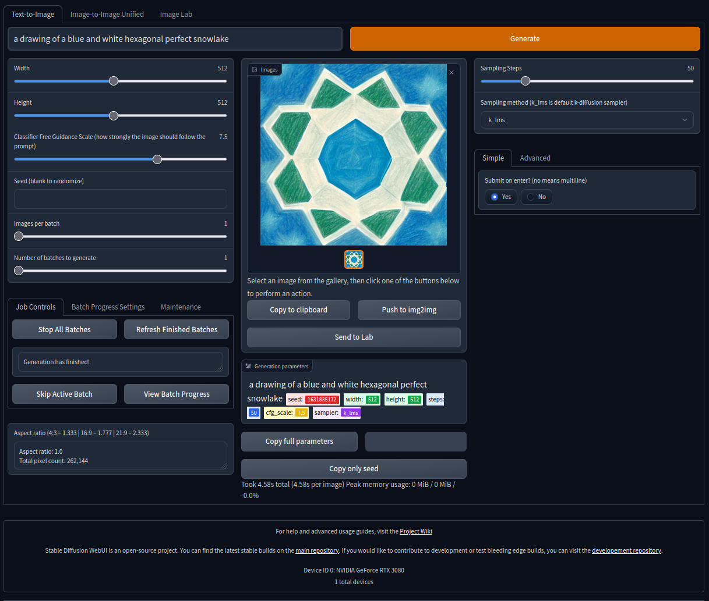

# stable-diffusion-flake


<!--toc:start-->
- [stable-diffusion-flake](#stable-diffusion-flake)
  - [status](#status)
  - [notes](#notes)
  - [contribute](#contribute)
  - [usage](#usage)
  - [developer usage](#developer-usage)
  - [future usage](#future-usage)
      - [UX goal:](#ux-goal)
    - [todo:](#todo)
  - [credits](#credits)
  - [screenshot](#screenshot)
<!--toc:end-->

## status

**Still a WIP** - There is a working mode, but it relies on venv/pip-installing a bunch of crap.
Ideally we can package the rest and remove the hacks and etc.

Both the worth hacky version (`stable-diffusion-webui-pip.nix`) and devlopment-ideal version (`stable-diffusion-webui.nix`) are documented here:

NOTE: This works with [AUTOMATIC1111/stable-diffusion-webui](https://github.com/AUTOMATIC1111/stable-diffusion-webui) as well

## notes
- warn: pytorch takes forever to build, you might want to use the cache defined in the flake!
- warn: this uses [my `nixpkgs` branch "`stable-diff`"](https://github.com/colemickens/nixpkgs/commits/stable-diff)
where I've shamelessly disabled tests, etc to get things "working"
- tip: use Chromium instead of Firefox. With Firefox I've had to restart the server rather often to workaround a hang

## contribute

Do you love Python? Do you have lots of spare time? Do you want to help make this a cool demo of Nix's usefulness
especially in hairy-spaces like ML/python/etc?

I've mostly added the outlines of all listed packages in
[my `stable-diff`"](https://github.com/colemickens/nixpkgs/commits/stable-diff)
nixpkgs branch. Feel free to just pick one and fix it up
and then attempt to load the "default" devshell and see how far you get.

## usage
- (this is the "working", unfinished way that relies on shellHook, pip, etc):

```shell
# use the stable-diff cache (or just accept the flake settings)
> cachix use stable-diff

# prepare
mkdir -p "${HOME}/code/stable-diffusion-webui"
git clone "https://github.com/sd-webui/stable-diffusion-webui" "${HOME}/code/stable-diffusion-webui"

# enter the SD-WEBUI directory
# this assume you've already moved the model into place too!
cd "${HOME}/code/stable-diffusion-webui"

# enter a shell
> nix develop 'github:colemickens/stable-diffusion-flake#webui-pip'

## inside devshell, pip will install a bunch of extra stuff
## inside devshell, now launch the webui relauncher:
$ python scripts/relauncher.py

# wait...
# and now UI is running on port 7860
```

## developer usage
```shell
# enter a shell
> nix develop "$HOME/code/stable-diffusion-flake#webui-pip" \
  --override-input "nixpkgs" "$HOME/code/nixpkgs/stable-diff"
```

## future usage
```shell
nix run "github.com:colemickens/stable-diffusion-flake#webui"
# (first-time) accept suggested cache / trusted-keys
# wait...
# and now UI is running on port 7860
```

(and/or a nixos module...)
#### UX goal:
1. user download model file to cache dir
1. `nix run`
1. launcher script hardlinks the model file
1. launcher script then calls the web-ui's "relauncher" script

### todo:
- derivation for stable-diff-ui
- derivation for copying in the LDSR repo it whines about?
- derivation for startup script
- (*future*): maybe support nixgl, but I'm lazy and have no non-NixOS linux

## credits
- **@adisbladis**: for the initial `shell.nix`
- **@cfhammill**: snagged the `ps.albumentations` drv from [their ML PR](https://github.com/NixOS/nixpkgs/pull/165715)
- **@pbsds**: fixed up my gradio deriv with part of [pbsds's gradio PR](https://github.com/NixOS/nixpkgs/pull/187032)

## screenshot


